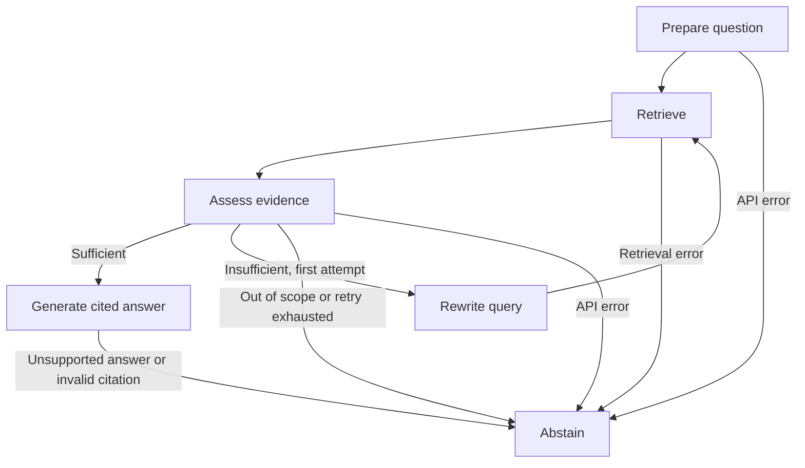

# Design explanation

The useful question for this assignment is whether the system can find and use the right
passage. The implementation therefore keeps the interface small and makes retrieval,
citations, and failure decisions visible through the CLI's `--trace` option.

## Ingestion and retrieval

Both PDFs come from NIST. Chunks stay inside a physical page and a detected section, with
up to 220 embedding-model tokens and 32 tokens of overlap. Short chunks suit MiniLM and
make page citations precise. The cost is losing some wider context, especially in tables.

FastEmbed runs MiniLM locally on the CPU. Qdrant local mode stores its 384-dimensional
vectors on disk. Neither needs a paid service. PDF hashes and the model/chunking settings
form an index signature, so repeating ingestion does not insert duplicate records.
Rebuilds prepare a separate directory before replacing the old index.

Retrieval combines cosine similarity with BM25. Dense search helps with paraphrases;
BM25 helps with exact terms such as GOVERN and confabulation. Reciprocal rank fusion
combines their rankings without assuming the scores are comparable. Common document-name
words are removed from the lexical query when more specific terms are available.
Near-duplicate passages are removed before choosing six excerpts.

The real-corpus check exposed cover pages and bibliography entries being ranked above
useful content. Those pages are excluded for these specific document editions. The
application still records original physical page numbers, without renumbering the body.

## LangGraph workflow

The state contains messages, the original question, the standalone question, the current
search query, excerpts, selected source IDs, the evidence verdict, retry count, error,
final answer, sources, and the visited node names. Turn-specific fields are cleared at
the start of every turn; the message history is retained by LangGraph's reducer.

Every substantive question retrieves fresh evidence. For a follow-up, the first node
uses the last three conversation turns to resolve references into a standalone question.
That history helps interpret the question; it is never passed off as document evidence.
A new thread ID separates conversations. `InMemorySaver` holds thread state while the
process runs. A persistent checkpointer would be the next step if restart recovery mattered.

The assessor must decide whether the excerpts contain the actual answer. Topic similarity
alone is insufficient. It can select evidence, reject an unrelated question, or suggest a
better search query. One retry is allowed. Keeping the original standalone question
separate from the retry query prevents the answer task from silently changing.

## Grounding and failure handling

The answer model returns short claims and source IDs in JSON. The application accepts
only IDs from the selected evidence, then builds the source list from stored metadata.
Multiple claims can share a citation; unused retrieval hits do not appear as sources.
An answer without evidence, or with an invented reference, is rejected.

This does not prove semantic entailment. Adding a second model-based answer verifier
would add latency and quota use while still needing evaluation. For this small prototype,
an evidence assessment, constrained generation, citation validation, and explicit
limitations are a reasonable starting point.

Transient API failures and malformed responses have bounded retries. Long rate-limit
waits, invalid credentials, and unrecoverable errors are reported clearly. Missing
evidence produces an abstention; an unavailable API produces an operational error.
These are different outcomes and have different result statuses.

## What would improve next

A larger, separately labelled evaluation set would come first. In particular, it should
cover multi-document comparisons, table rows, ambiguous references, unsupported premises,
and prompt injection. Those results would determine whether to add a reranker, expand
neighboring chunks, or improve table extraction. A bigger model or another agent would
not be the first change without evidence that it helps.
